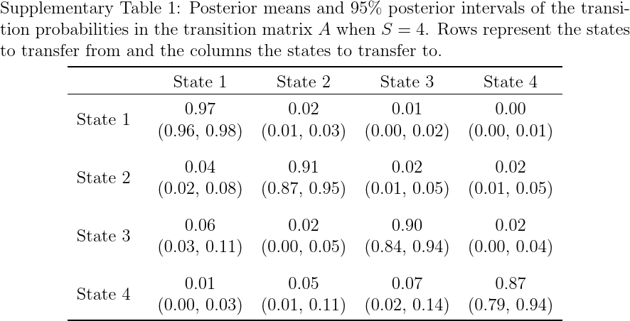
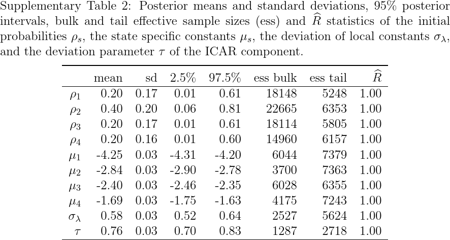
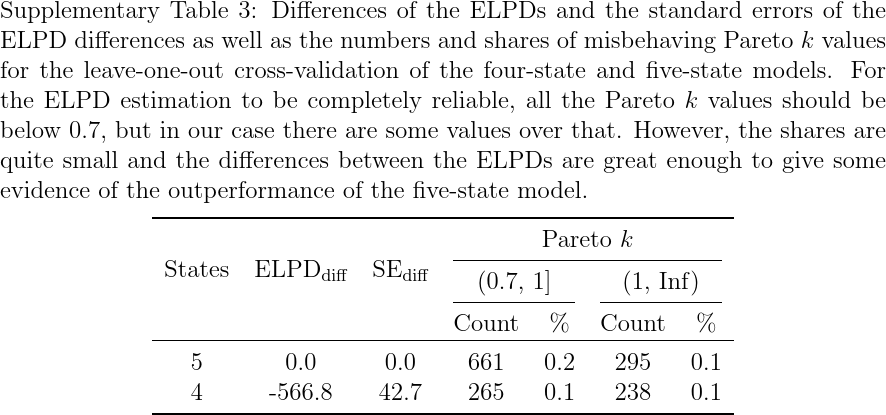
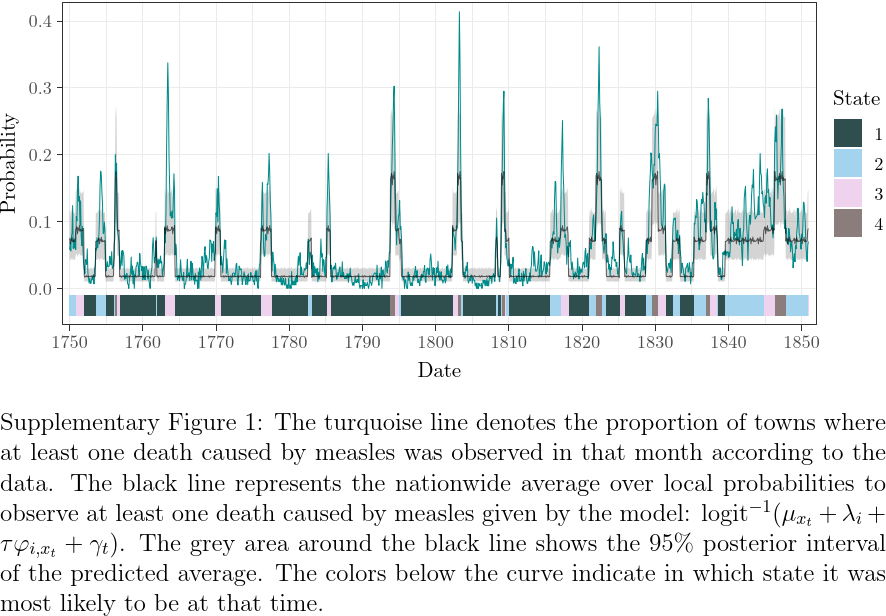
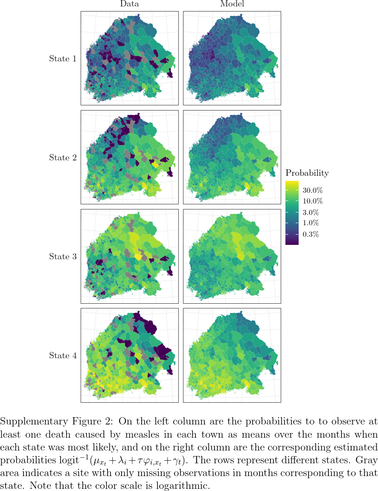
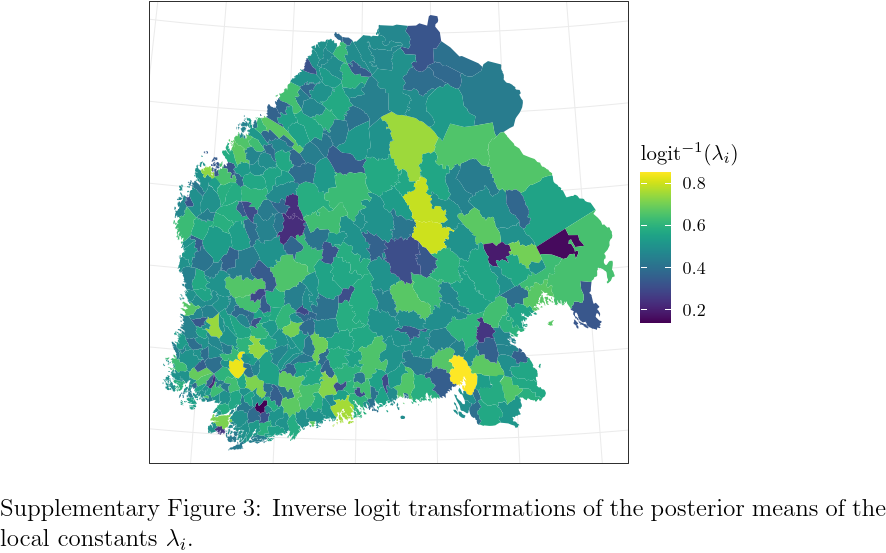
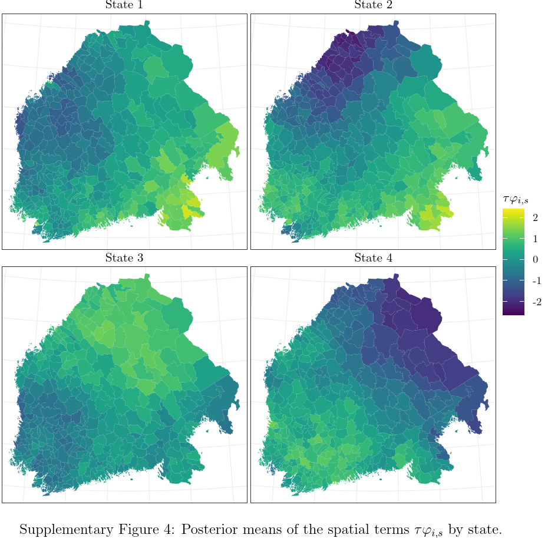
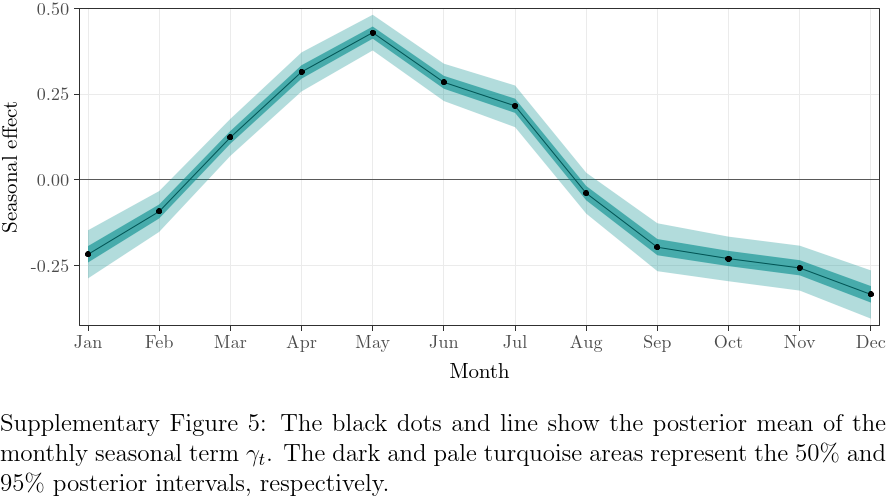
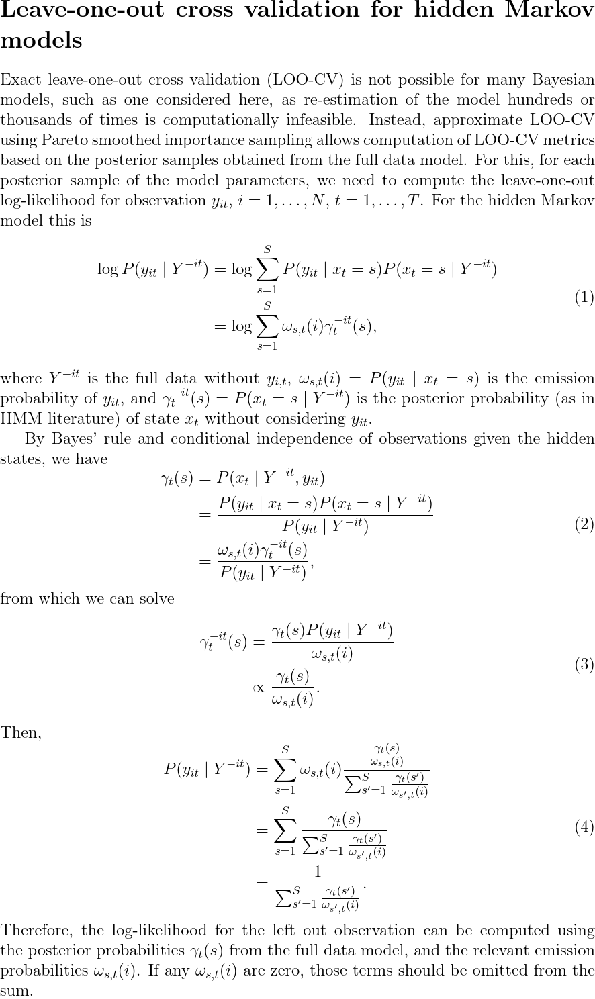

# spatialHMM

Supplementary material for the paper *Hidden Markov modelling of spatio-temporal dynamics of measles in 1750-1850 Finland*.

## Files

This repository contains the following files:

- `measlesdata.rds`: The data needed for fitting the model. These contain the monthly, regional, dichotomous death occurrences from January 1750 to December 1850. Also information about the neighbours is included. A more detailed description of the file contents can be found from the file `hmm_icar_bernoulli.R`.
- `hmm_icar_bernoulli.stan`: technical specification of the model in Stan language.
- `hmm_icar_bernoulli.R`: R codes to fit the model. This file also includes description of the data.
- `hmm_changepoint.stan`: technical specification of the change point model in Stan language.
- `hmm_changepoint.R`: R codes to fit the change point model.
- `supplementary_material.pdf`: the supplementary materials as one .pdf file.

In addition, all the supplementary figures can be found from the folder `figures`.

## Tables

Supplementary tables 1 and 2 describe the transition matrix and the time-invariant and site-invariant parameters of the four-state model.

## Figures

Supplementary figures 1-5 illustrate the estimated states, spatial parameters and seasonal effect of the four-state model.

## Leave-one-out cross validation for hidden Markov models

Supplementary theory for calculating the leave-one-out log-likelihoods used for the cross-validation.

